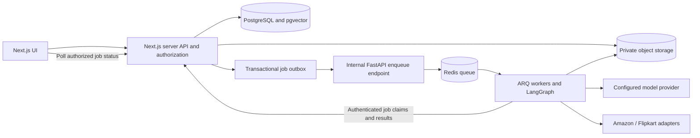

# AI Listing Agent — MVP execution plan

> **Local implementation update (2026-09-13):** PostgreSQL and password sign-in, session/membership checks, seeded catalog, server-side saves/revisions and review approvals now work locally. See `test/README.md` and the latest `Memory.md` entry. This is a partial implementation across the tasks below; existing full-MVP checkboxes are not marked complete from local testing alone.

<!-- File purpose: the ordered implementation backlog and release gates for this product.
Future maintainers: update task status and evidence here; put architectural context and
session handoffs in Memory.md. Do not mark simulated functionality as production work. -->

Last reconciled with the repository: **2026-09-18**.

> **XLSM catalog and export slice (2026-09-19):** Four imported Amazon India category definitions drive the product/editor form and a local fictional demo dataset. Exact-key answers live on template-pinned revisions. Approved downloads now fill the original Template tab as XLSM or CSV, with one SKU per row and separate files per category/version in bulk ZIPs. Hosted rollout, full conditional rules, direct API submission and Amazon acceptance remain pending; see `test/amazon-templates/README.md`.

> **Dataset/auth update (2026-09-15):** The local dataset now has a runtime contract and complete frontend-to-Prisma mapping in `test/DATASET.md`. A normalized username migration is applied; the local demo login is `sngram` / `sngram`. All three migrations, the production build, 9 prototype tests, 18 schema tests, dataset validation and authenticated local integration passed. Hosted authentication and production credential policy remain open work.

## 1. Product outcome

Build an invite-only SaaS for Indian sellers and agencies to turn messy product information into accurate, brand-aware Amazon and Flipkart listings. A seller must be able to create a workspace, enter a product with variants or import a CSV, generate channel-specific content, resolve validation errors, review an exact revision, and export a supported marketplace file or submit through an authorized marketplace connection. The dashboard must show actual durable job and marketplace outcomes.

The UI should retain the supplied dark design: compact navigation, searchable SKU catalog, three-column listing editor, validation panel, and explicit publishing dialog. Improve responsiveness, accessibility and clarity as real data is integrated. Keep useful file-purpose and section comments so another developer can find where to edit each page.

### Required scope

- Invite-based access and Google sign-in; support individual, agency and freelance profiles.
- Teams, membership roles, folders, workspaces, and one brand context per workspace.
- Brand name, tone, glossary, banned terms and customer pain points; tenant-scoped brand retrieval.
- Amazon and Flipkart channel listings attached to product variants, with independent content and status.
- Manual SKU creation, CSV intake, product images, merchant facts, pricing, inventory and logistics.
- Canonical extraction, Redis/ARQ jobs, LangGraph catalog/keyword/A+ generation, bounded correction and stored audits.
- Human editing, revision history, approval, marketplace-specific export and direct submission with outcome tracking.
- Durable data, tenant isolation, usage limits, operational visibility, backups and a verified deployment.

### Delivery boundaries

Deliver in usable increments: **durable catalog → generated and reviewed listings → official export beta → connected publishing → complete MVP release**. The export beta is an intermediate milestone, not completion of the requested direct-publishing scope.

Start with one explicitly verified product category per marketplace and the India region. Apparel/ethnic wear is the working candidate from the screenshots, not a confirmed API category. Support only categories with checked official schemas/templates; do not claim every Amazon/Flipkart category works. Platform capabilities and A+ eligibility must be verified during implementation.

Defer Shopify, orders, accounting, repricing, automatic stock synchronization, ad management, sales attribution, competitor scraping, mobile apps, paid subscription billing, custom enterprise roles and multiple seller accounts for the same variant/platform/region. Merchant-entered stock is in scope; live inventory synchronization is a separate future feature. Invite-only beta access can use manually assigned quotas without a payment integration.

## 2. Instructions for the next developer or model

1. Read applicable `AGENTS.md` files, this file, `Memory.md`, `frontend/README.md`, and `frontend/prisma/README.md`. Check the actual files and Git diff; older scaffold descriptions in Memory are historical.
2. Find the first unchecked task whose dependencies are complete. Finish a small vertical slice, including its failure paths and relevant verification, before starting another large feature.
3. Preserve unrelated local changes, especially the user's `test/data.prisma` draft and `assets/`. The canonical schema is `frontend/prisma/schema.prisma`.
4. Use existing components and routes. Keep route files focused on page content; move API, authorization and workflow logic into named modules. Add purpose comments and comments for non-obvious constraints, not comments repeating every line.
5. Distinguish demo and live mode. Never make sample sign-in, generated text, connection badges, scores or seeded publication states appear to be real integrations. Never silently fall back to demo data on a live API error.
6. Record each finished task's changed files, commands/tests and result under that task. A checkbox requires its acceptance criteria to pass. A written plan, passing mock test or existing schema alone does not complete a live integration.
7. Update `Memory.md` with the latest architecture, working commands, remaining blockers and next task. Keep this task list as the single source of completion status.
8. Use Prisma migrations as the only database migration authority. Preserve custom SQL constraints. Never use `db push` as a substitute, edit an already applied migration, reset a database, or introduce parallel Alembic schema ownership.
9. Keep secrets server-side and out of logs, fixtures, snapshots, committed files and `NEXT_PUBLIC_*`. Use example values in committed env templates.
10. This roadmap describes future work; it does not itself authorize production deployment, real seller publication, account purchases, messages to third parties or destructive data operations. Use the user's authorization for the task being executed. Continue independent work when an external integration is unavailable and record the precise blocker.

Status convention: `[x]` verified artifact/task, `[ ]` pending. For partial work leave the box unchecked and add a progress note. Record blocked work with the missing input and the next unblocked task; do not erase its acceptance criteria.

## 3. Verified starting point

- [x] **BASE-01 — Frontend prototype.** Auth/onboarding screens, dashboard, SKU catalog, intake, variants, editor, local validation, review CSV, settings and help exist. The current local catalog and edits persist through authenticated Next.js API routes to PostgreSQL; generation and review CSV remain samples. Evidence: `frontend/README.md`, route/component files, production build and 9 focused prototype tests.
- [x] **BASE-02 — Canonical relational design.** Prisma models include pgvector, tenant-scoped foreign keys, revisions/approvals, money and lifecycle constraints, plus versioned channel templates. Evidence: `frontend/prisma/schema.prisma`, four committed migrations and `frontend/prisma/README.md`.
- [x] **BASE-03 — Schema tooling and isolated checks.** Prisma 7.10 CLI/client are installed and pinned; generate/validate/build passed. All 19 migration/constraint tests passed against in-memory PGlite with pgvector. The four migrations are applied to the local PostgreSQL application database; hosted Supabase still has only the earlier three until deliberately upgraded.
- [x] **BASE-04 — Project handoff documentation.** `Memory.md`, frontend edit guide, Prisma relationship/field guide and this ordered roadmap exist.

Frontend refinement follow-up (2026-09-13): requested local Inter/Paper Mono fonts, shared UI polish and responsive prototype checks are implemented. Read `frontend/UI-REVIEW.md` for exact evidence and limitations. MVP-32 remains open for the integrated product's complete UX/accessibility review.

**Still pending:** production-grade auth/recovery/invitations, persistent media storage, worker orchestration, actual LLM calls, live conditional marketplace rules and seller validation, Flipkart export and Amazon acceptance verification, OAuth connections, direct publishing, a fully verified hosted deployment and complete browser end-to-end coverage. The Python backend feature modules remain mostly scaffolded; current CRUD and Amazon template export run through authenticated Next.js/Prisma routes.

The generated Prisma client is ignored build output, not a deployed database. Amazon downloads now use original template files; successful file generation is not proof of marketplace acceptance. SQL foreign keys do not enforce user permissions, successful audits, latest-revision policies or all job transitions; service checks are required.

## 4. Architecture baseline to ratify in MVP-01

The following is the recommended implementation baseline for the new Prisma requirement. It is a proposed refinement of the original browser-to-FastAPI scaffold, not a claim that these services already exist.



- **Next.js server:** same-origin user API, sessions, authorization, Prisma PostgreSQL adapter/client, domain transactions, revisions, approvals, job records, outbox and status queries. Prisma is server-only.
- **Python:** typed extraction, LangGraph, validation, file transforms, external marketplace adapters and ARQ execution. Workers use narrow authenticated internal API contracts to claim jobs/read frozen input/write results; they do not accept arbitrary workspace IDs as authorization or own a second ORM schema.
- **Durability:** create job and outbox entry in one database transaction; a retryable dispatcher calls the internal enqueue API. Queue delivery is at least once. Workers must claim jobs atomically, use leases and tolerate duplicates. Redis is not the only record of work.
- **Storage:** private S3-compatible objects for originals, gallery assets and exports; database stores keys and metadata. Short-lived authorized URLs are generated on demand.
- **Frontend:** explicit API DTOs and server state replace localStorage business records; browser storage is limited to harmless preferences or an isolated demo mode. Use polling initially for job status; SSE is optional later.
- **Schema evolution:** the existing 21 models are a foundation. Sessions/token flows, outbox/leases, usage accounting and operational audit events may require new models or fields. Design these in additive migrations as their services are implemented.

### Domain rules that must survive implementation

| Area | Rule |
| --- | --- |
| Ownership | Team owns workspaces; membership supplies the role; all reads and writes enforce tenant scope. Team folders cannot contain another team's workspaces. |
| Brand | One brand context per workspace. An agency uses separate workspaces for different client brands. |
| Product | Parent stores shared product facts; variant stores sellable SKU/options/pricing/stock/logistics; channel listing stores ASIN/FSN and marketplace state. |
| Money | Serialize exact decimal amounts as decimal strings; never compute persisted prices with binary floating point. Currency is explicit. |
| SKU | Case-insensitive unique SKU per workspace; soft deletion does not silently free its identity. |
| Content | Append-only saved revisions capture content, merchant facts, media and brand context. Updates use an expected revision/version to detect concurrent edits. |
| Approval | Approval identifies an exact revision and successful applicable audit. A content, facts, media, brand or target change must trigger an explicit freshness policy and re-review when relevant. |
| Publishing | Execution rechecks active approval, permissions, target, payload and connection. Export-ready, submitted, and confirmed published are separate outcomes. |
| AI | Unknown product facts remain unknown. Images and raw notes are untrusted input; generated claims require supporting merchant facts. |
| Jobs | Retries are bounded, duplicate deliveries are safe, and crashed workers cannot leave work permanently processing. |

### Intended code ownership

| Location | Work to add or maintain |
| --- | --- |
| `frontend/app/` | Existing screens and proposed `api/v1/` user routes plus restricted internal routes |
| `frontend/lib/server/` (new) | Prisma client, auth, policy, domain services, transactions, outbox and adapters to internal APIs |
| `frontend/lib/api/`, `frontend/lib/hooks/`, `frontend/types/` | Typed browser clients, queries/mutations and view models |
| `frontend/components/` | Shared UI and page-specific components, with file-purpose comments |
| `frontend/prisma/` | Schema, authoritative migrations and database documentation |
| `backend/core/` | Validated settings, internal-service authentication, structured errors and logging |
| `backend/modules/data_bridge/` | Input parsing, field mapping, extraction and canonical contracts |
| `backend/modules/ai_engine/` | Graph, agent contracts, prompts, brand context and model gateway |
| `backend/modules/validation/` | Versioned channel/category rules and audit output |
| `backend/modules/execution/` | Official exports, marketplace adapters and result reconciliation |
| `backend/workers/`, `backend/storage/` | ARQ jobs, job claim lifecycle and authorized object access |
| `docs/` (new as needed) | Architecture decisions, API contracts, marketplace capability matrix and operations runbooks |
| `frontend/tests/`, `backend/tests/` (new), browser tests | Schema, domain, worker, integration and user-journey checks |

## 5. Ordered implementation backlog

### Milestone A — Reliable development environment and API foundation

- [ ] **MVP-01 — Record the architecture and initial supported scope.** Depends: BASE-01–04.
  - Create `docs/architecture.md` covering the baseline above, deployment boundaries, job transport, auth strategy and database ownership. Reconcile the stale FastAPI/SQLAlchemy assumptions in README and dependency files.
  - Create `docs/marketplace-capabilities.md`: India region, candidate categories, export format, listing API, media and A+ capabilities, evidence/source date, account access needed and unsupported operations. Verify official documentation when implementing; do not assume a fixed 198/70 column count across categories.
  - **Done when:** there is one coherent architecture and an explicit support matrix; uncertain external capabilities remain marked unverified with owners/inputs.

- [ ] **MVP-02 — Provision a reproducible local stack.** Depends: MVP-01.
  - Extend Compose with PostgreSQL + pgvector, Redis, an ARQ worker, outbox dispatcher and private S3-compatible local storage. Add named volumes, health/readiness checks and startup dependencies; avoid exposing internal services unnecessarily.
  - Align Python dependency installation between `pyproject.toml`, requirements and Docker; pin a compatible runtime/toolchain and lock dependencies. Use Node 22.12+ for the installed Prisma toolchain. Provide secret-free env examples for every service.
  - **Done when:** a clean local checkout can install/start the stack using documented commands, dependencies report readiness, and restart preserves database/media data. Document stop/start without deleting volumes.

- [ ] **MVP-03 — Connect Prisma to real development PostgreSQL.** Depends: MVP-02.
  - Add the Prisma-version-compatible PostgreSQL driver adapter and server-only client module with safe development reuse and production pooling configuration. Apply the reviewed initial migration to the designated development database.
  - Add separate fixtures/seeding for development and tests; require an explicit development flag. Preserve custom SQL constraints and verify pgvector availability. Record that raw SQL/Python clients must supply UUID/timestamp values where Prisma generates them client-side.
  - **Done when:** a server-side transaction creates and reads a tenant/product fixture; data survives restart; migration history is clean; tests pass on both PGlite and actual PostgreSQL. No demo records seed production automatically.

- [ ] **MVP-04 — Establish typed API and internal job contracts.** Depends: MVP-01, MVP-03.
  - Define request/response schemas, validation, pagination, decimal strings, ISO timestamps, IDs, error codes, field errors, request IDs and conflict responses. Generate or share checked TypeScript/Pydantic contract fixtures.
  - Introduce versioned public routes and service-only routes. Specify job claim, heartbeat, completion and failure contracts with authenticated identity, expiry/replay protection and job-scoped authorization.
  - **Done when:** invalid requests fail predictably, browser bundles contain no server secrets/client, and TS/Python validate the same fixtures. Error responses do not leak credentials or internal traces.

### Milestone B — Identity, tenants and durable onboarding

- [ ] **MVP-05 — Implement secure sessions and login.** Depends: MVP-03, MVP-04.
  - Choose a maintained authentication implementation after checking compatibility. Implement Google OAuth state/PKCE as applicable, verified identity linking, session expiry/revocation/logout and secure HttpOnly cookies. Google sign-in must not bypass invite-only admission.
  - If retaining the pictured password login, add modern password hashing, reset/verification tokens, rate limits and recovery; do not build a plaintext or demo password path. Add the required session/token migration.
  - **Done when:** login/logout/recovery and expired/invalid sessions are tested; unauthenticated private pages/APIs are rejected; mutation CSRF/origin protections work; demo credentials never authenticate a live user.

- [ ] **MVP-06 — Bootstrap ownership and implement invitations.** Depends: MVP-05.
  - Provide an explicit local/operator bootstrap process for the first owner, with no public unguarded owner creation endpoint. Implement invite creation, preview, hashed random token, recipient binding, expiry, revocation and transactional single-use acceptance.
  - Use a development mail sink for tests. Add a production email adapter with configured sender for product-generated invitations/recovery; real test messages need authorized recipients. Avoid revealing whether unrelated emails have accounts.
  - **Done when:** accepted users join only the invited team/role, replay and concurrent acceptance are safe, expired/revoked/wrong-recipient tokens fail, and raw tokens are never stored in the database or logs.

- [ ] **MVP-07 — Centralize membership and role policies.** Depends: MVP-05, MVP-06.
  - Implement OWNER/ADMIN/EDITOR/REVIEWER/PUBLISHER/VIEWER permissions in a single policy layer and document the matrix. Baseline: editors edit/generate, reviewers approve, publishers execute approved work, viewers read; owner/admin manage team settings. Permit a solo owner to perform the full journey; four-eyes review is not required by default.
  - Authorize every workspace query, mutation, media URL and job read. Prevent removing/demoting the last owner. Invalidate or recheck permissions when memberships change.
  - **Done when:** tests with two teams and multiple roles prove cross-tenant IDs, guessed URLs and forged workspace parameters cannot disclose or mutate data.

- [ ] **MVP-08 — Persist profile, teams, folders and workspaces.** Depends: MVP-07.
  - Wire profile → workspace → brand → optional connection onboarding to idempotent server operations. Support agency/individual/freelance, workspace switcher, team members and folder organization, empty states and interrupted onboarding recovery.
  - Define archive behavior and authorization for workspace/folder changes; retain historical records. Avoid duplicate teams/workspaces on repeated submissions.
  - **Done when:** onboarding survives browser/device changes, another permitted member sees the same workspace, and users cannot select archived/inaccessible workspaces as active.

- [ ] **MVP-09 — Persist versioned brand context and retrieval.** Depends: MVP-08.
  - Save structured glossary, banned terms, tone and pain points with validation. Track a context version/hash for generation snapshots and freshness checks.
  - Implement workspace-scoped context loading; add embedding generation/rebuild and parameterized vector retrieval where useful. Record embedding model/dimension; the present field is `vector(1536)`, so a different dimension requires a deliberate migration/re-embedding plan.
  - **Done when:** agents receive only the selected workspace's context; edits invalidate cached context; embedding failure is visible and has a defined retry or direct-context fallback; no cross-brand retrieval occurs.

### Milestone C — Durable catalog, media and imports

- [ ] **MVP-10 — Define canonical merchant and channel contracts.** Depends: MVP-04, MVP-01.
  - **Implemented foundation (2026-09-18):** `MarketplaceTemplate` versions and the macro-free Amazon XLSM extractor cover KURTA, PANTS, SHIRT and SHORTS. An authenticated metadata API and product/editor form now select category and browse node, collect per-variant exact-header answers, and persist template-pinned payloads. The candidate-row mapper resolves explicit shared facts. Four fictional product families/eight variants exercise this path locally. Flipkart contracts, conditional logic and complete merchant facts remain pending. See `test/amazon-templates/README.md`.
  - Define product/variant/channel JSON schemas including identity, source notes, category, options, prices, stock, HSN, country, dimensions, weight, tax, manufacturer/packer/importer and media references. Keep unknown facts null/missing with provenance and confidence where extracted.
  - Define typed category attributes and versioned channel mapping, including Flipkart pricing/fulfillment/handling fields where required by its verified template. Wire the imported Amazon field catalog into a dynamic product-type/browse-node selector and exact-header answers stored on a listing revision/payload; pin `templateId` on save. Do not make apparel-only fields universal required columns or conflate ASIN with FSN.
  - **Done when:** realistic single-variant and multi-variant fixtures round-trip through TS/Python contracts without losing merchant facts or precision; missing required publish fields produce actionable errors.

- [ ] **MVP-11 — Implement catalog CRUD and listing creation.** Depends: MVP-07, MVP-08, MVP-10.
  - Add transactional product/variant APIs, server-side SKU uniqueness, pagination/search/filter/sort, archive/restore and channel listing creation. Enforce money/stock rules, same-workspace references and optimistic concurrency.
  - Support Amazon and Flipkart listings for one variant with independent region/content/publication state. Adapt the current bundled demo Product type into explicit product, variant and listing DTOs.
  - **Done when:** create/edit/reload works in real DB mode, duplicate SKUs return field errors, concurrent edits return a conflict, and one channel's changes cannot overwrite the other.

- [ ] **MVP-12 — Implement private media uploads and gallery.** Depends: MVP-07, MVP-10, MVP-11.
  - Replace data URLs with upload initialization/completion, object metadata and ProductMedia ordering. Validate actual file type, size, dimensions and ownership; handle failed uploads and orphan cleanup. Establish scanning/quarantine rules for supported file types.
  - Add parent/variant main-image selection, gallery reorder/removal, accessible previews and upload progress. Restrict remote fetches to validated sources and defend against private-network URL fetches; signed URLs must not become permanent stored identifiers.
  - **Done when:** users cannot read/attach another tenant's objects, reload preserves galleries, invalid files are rejected, and exports/workers can access only authorized required assets.

- [ ] **MVP-13 — Build CSV preview, mapping and import service.** Depends: MVP-10, MVP-11, MVP-12, MVP-16.
  - Define a documented intake CSV distinct from marketplace output files. Provide downloadable sample, column mapping, encoding/quoting support, required-field validation, duplicate behavior and preview before commit.
  - Persist ImportBatch, source asset, row-level errors and counts; process bounded chunks with cancellation/retry and idempotent row keys. Default to reject/report conflicting SKUs; offer explicit update behavior only with a specified policy.
  - **Done when:** malformed, mixed-validity and repeated files have predictable results; interrupted imports resume safely; users can download errors and see actual counts without duplicate products.

- [ ] **MVP-14 — Wire the durable catalog UI.** Depends: MVP-11, MVP-12; bulk controls also depend on MVP-13.
  - Replace localStorage business state with typed API calls, loading/empty/error/retry states and invalidation after mutations. Keep demo mode visibly separate and never upload demo state into a real tenant automatically.
  - Add per-variant facts, category attributes, multi-channel tabs, gallery and real server pagination. Fix hard-reload onboarding defaults, unsaved sidebar navigation and stale generation responses that could overwrite new edits.
  - **Done when:** the catalog works across two browser sessions, failed saves preserve editable input, navigation warns about dirty edits, and no fake connections or publication statuses appear in live mode.

### Milestone D — Durable jobs, extraction and AI workflow

- [ ] **MVP-15 — Add durable job/outbox and usage schema.** Depends: MVP-03, MVP-04.
  - Design additive migrations for the outbox, job lease/heartbeat/cancellation fields, idempotency scopes and append-only usage/operational events that are not covered by current models. Define retention and indexes for queue/status queries.
  - Persist actor, workspace, frozen input, request key, attempt limits and timestamps. Specify valid state transitions and transaction boundaries for generation, import and publication.
  - **Done when:** database/service tests reject invalid transitions and cross-tenant associations; job creation and enqueue intent commit or roll back together.

- [ ] **MVP-16 — Implement dispatcher and resilient ARQ execution.** Depends: MVP-02, MVP-04, MVP-15.
  - Add outbox dispatch with retries/backoff, authenticated internal enqueue, atomic worker claims, leases/heartbeats, timeout handling, cancellation and recovery of abandoned processing jobs. Bound concurrency by workspace/provider.
  - Implement idempotent completion, poison-job/manual retry handling and reconciliation when Redis loses queued entries. Acknowledgment loss must not duplicate domain results.
  - **Done when:** integration tests kill/restart workers and Redis, redeliver jobs and drop enqueue responses; jobs reach a truthful terminal or retryable state without duplicate revisions or permanently stuck processing.

- [ ] **MVP-17 — Implement extraction and merchant confirmation.** Depends: MVP-10, MVP-12, MVP-16.
  - Parse raw notes and supported images into canonical facts; distinguish deterministic parsing from model extraction. Preserve source references and confidence; validate output before saving.
  - Present uncertain or conflicting facts for merchant confirmation. Treat instructions inside uploads as product data, restrict tool capabilities and never invent fabric, certifications, health claims or compliance identifiers.
  - **Done when:** fixture tests cover noisy Hindi/English text, missing facts, contradictory sources and malicious embedded instructions; unconfirmed required facts block publish readiness.

- [ ] **MVP-18 — Add model gateway and controlled generation.** Depends: MVP-09, MVP-16, MVP-17.
  - Select provider/models using current official documentation and explicit configuration; implement structured output, request timeout, provider retries, token accounting, per-workspace budgets and test doubles. Record model/prompt/input versions without leaking sensitive input into routine logs.
  - Freeze facts and brand context for each generation request. Support regenerating a selected field without overwriting unrelated human edits; use request/version checks to reject stale results.
  - **Done when:** missing credentials fail clearly, malformed provider output is contained, time/cost limits are enforced and duplicated requests do not cause unbounded paid inference.

- [ ] **MVP-19 — Implement the three-agent LangGraph.** Depends: MVP-18, MVP-20.
  - Catalog agent generates title/bullets/description; keyword agent creates relevant search terms without pretending to know live search volume; A+ agent drafts supported content modules and media references.
  - Join structured outputs, run validation, and send precise failures through a bounded targeted correction loop. Default to at most two correction rounds unless configuration explicitly changes it; terminate with saved errors/manual-review state after exhaustion.
  - **Done when:** happy path, one-repair path, repeated failure, cancellation and provider outage are tested; successful output creates a new revision rather than modifying a previously approved revision.

- [ ] **MVP-20 — Implement a versioned validation service.** Depends: MVP-10, MVP-17.
  - Build rulesets from checked official category/channel contracts and brand constraints. Validate required attributes, allowed values, text limits, keyword formatting, prohibited terms, media, prices and logistics. Preserve error/warning distinction and field pointers.
  - Store ValidationRun with revision, ruleset version, score explanation and complete result. Define deterministic normalization and freshness policy. The prototype's text lengths and score are not marketplace guarantees.
  - **Done when:** rule fixtures cover both channels, false-positive edge cases and invalid merchant facts; blocking errors prevent approval irrespective of score; ruleset changes can trigger a fresh audit.

- [ ] **MVP-21 — Connect workflow progress to the dashboard.** Depends: MVP-14, MVP-16, MVP-19.
  - Show actual job stages, queued/running counts, last update, attempts and actionable failure reason. Implement authorized polling with backoff/visibility handling and stop at terminal state; distinguish generation, validation and marketplace publication.
  - Provide permitted retry/cancel actions and progress for bulk imports. Calculate catalog/dashboard totals from database queries with bounded indexes, not seed arrays.
  - **Done when:** two sessions observe the same job progress, refresh does not reset status, stale/disconnected polling is indicated and a failed job can recover without duplicating work.

### Milestone E — Review, immutable approval and official export

- [ ] **MVP-22 — Implement revision-aware editing and history.** Depends: MVP-11, MVP-19, MVP-20.
  - Save append-only content/fact/media/brand snapshots and versioned MarketplacePayload. Add history, comparison and restoring an old version as a new revision; use expected revision checks for saves and generation results.
  - Expose channel-specific title, bullets, description, keywords and A+ module editing with previews. Clearly separate merchant facts from generated marketing content.
  - **Done when:** an old revision and its payload cannot be silently changed; simultaneous editor/worker saves produce a visible conflict; history identifies author/source and exact inputs.

- [ ] **MVP-23 — Enforce audit-backed human approval.** Depends: MVP-07, MVP-20, MVP-22.
  - Approve/revoke in a transaction after checking reviewer role, current revision, matching passed audit and freshness of the reviewed facts, media, brand rules and target. Define when edits invalidate readiness and queue cancellation versus require reapproval.
  - Show blockers, warnings, exact revision, reviewer and review timestamp. Solo owners may approve their own work; preserve explicit human action.
  - **Done when:** stale/failed audits, revoked approval, role removal and edit/approve races cannot authorize publishing; changing product facts after review is handled by a tested policy.

- [ ] **MVP-24 — Implement official channel export adapters.** Depends: MVP-01, MVP-10, MVP-12, MVP-20, MVP-23.
  - **Partial implementation (2026-09-19):** Amazon XLSM/CSV template filling, immutable source archive, approved revision checks and category-separated bulk ZIPs are implemented and locally verified. Flipkart, seller acceptance checks and durable export-job artifacts remain open.
  - **Implemented foundation (2026-09-18):** four India Amazon XLSM field catalogs, exact header ordering/choices, immutable version storage, local import, searchable dynamic fields, exact-key saved answers and candidate-row gap reporting. Local review approval blocks missing unconditional category answers. No accepted Amazon upload or official flat-file writer exists yet.
  - Obtain the official supported category templates and representative sanitized seller files. Map approved revision snapshots to required headers, enums, variation relationships, units, media references and channel-specific attributes; persist template/version provenance.
  - Build a server-side editor/API that reads the active template, groups repeated fields, evaluates conditional dependencies where verifiable, stores seller answers under exact keys, and refreshes mappings when a new template version arrives without rewriting approved revisions. Flag unresolved conditional requirements for human review.
  - Produce the actual required format and label it accurately. Amazon now offers its original XLSM workbook or Template-tab CSV; the obsolete generic review CSV download was removed.
  - **Done when:** golden-file and round-trip tests pass for both scoped marketplaces, all required data comes from approved snapshots, outputs survive spreadsheet handling without formula injection, and an authorized platform validation/upload trial confirms acceptance or documents specific returned issues.

- [ ] **MVP-25 — Finish export workflow and downloadable history.** Depends: MVP-16, MVP-23, MVP-24.
  - Queue export jobs with idempotency and immutable targets; store private export assets, checksums, filenames, template version and expiry. Provide authorized download/history, per-item bulk outcomes and actionable failure handling.
  - Export completion is `EXPORT_READY`, never `PUBLISHED`. Recheck active approval before export execution and prevent stale download links from bypassing access removal.
  - **Done when:** a seller can create → generate → edit → validate → approve → download an accepted supported-category file from persistent data. This completes the **official export beta**, with direct API scope still pending.

### Milestone F — Connected marketplace publishing

- [ ] **MVP-26 — Implement marketplace connection lifecycle.** Depends: MVP-01, MVP-07, MVP-08.
  - Verify the official authorization flow and app/seller requirements independently for Amazon and Flipkart. Implement the supported flow, callback/state validation, encrypted token storage, refresh, expiry/revocation and disconnect. Never present an OAuth flow the platform does not support.
  - Track seller identity, region, scopes/capabilities, token expiry and last connection check. Restrict connection management roles, mask identifiers as appropriate and rotate encryption keys using a documented plan.
  - **Done when:** an authorized test account connects and refreshes correctly; wrong workspace/state, expired/revoked credentials and insufficient permissions fail safely; tokens never reach the browser or snapshots.

- [ ] **MVP-27 — Implement Amazon submission and reconciliation.** Depends: MVP-16, MVP-23, MVP-26, Amazon portion of MVP-24.
  - Select the documented API/feeds operation appropriate to the verified category and seller capability. Map the approved payload, validate required facts, respect rate limits and submit with bounded retries and internal idempotency.
  - Store submission IDs and per-item responses; reconcile async processing via supported polling/events. A network timeout after submission is an unknown outcome to reconcile before retrying, not proof of failure.
  - **Done when:** contract tests cover accepted/rejected/rate-limited/ambiguous/partial responses, an authorized test submission is verified, and only confirmed channel status produces `PUBLISHED`/`LIVE`.

- [ ] **MVP-28 — Implement Flipkart submission and reconciliation.** Depends: MVP-16, MVP-23, MVP-26, Flipkart portion of MVP-24.
  - Verify whether the account/API supports catalog creation, offer/listing updates and media for the chosen category. Implement only documented supported operations, FSN/SKU identity handling, required attributes, QC errors and async status reconciliation.
  - Keep unsupported actions visibly disabled with a precise explanation and export/manual path. An unavailable approval/API capability is an external blocker on direct publishing, not a completed adapter.
  - **Done when:** tests cover QC rejection, auth expiry, throttling, timeout ambiguity and partial results; authorized account evidence verifies supported submission and final status. Record any remaining capability gap explicitly.

- [ ] **MVP-29 — Finish the publishing coordinator and UI.** Depends: MVP-23, MVP-25, MVP-27, MVP-28.
  - Add server-side preflight and explicit route/channel/seller/revision confirmation. Snapshot the target; queue one auditable attempt per channel and recheck approval, authorization, connection and freshness immediately before external submission.
  - Present submitted/processing/live/rejected states separately, with retry only for eligible failures. Support one-channel success and another-channel failure; do not roll successful remote work back automatically or resubmit it with a blind bulk retry.
  - **Done when:** race/replay and partial-failure tests pass, a removed publisher cannot execute new work, and the UI cannot publish a different revision/connection from the confirmed target.

- [ ] **MVP-30 — Complete A+ draft and delivery boundaries.** Depends: MVP-19, MVP-22, MVP-26.
  - Implement editable supported modules, asset selection and a preview using approved claims. Verify platform/account eligibility and separate A+ submission requirements; do not equate a draft module with published A+ content.
  - Deliver draft/export/manual handoff for unsupported channels; integrate direct A+ submission only where verified and enabled in the capability matrix. Track its approval/status separately when it has an independent lifecycle, with a migration if needed.
  - **Done when:** sellers can generate/review/use the promised A+ draft, unsupported operations are explained, and any advertised automated delivery has verified end-to-end evidence.

### Milestone G — SaaS readiness, verification and release

- [ ] **MVP-31 — Add beta quotas, usage and operational audit.** Depends: MVP-07, MVP-15, MVP-18, MVP-29.
  - Set documented per-team limits for generation, simultaneous jobs, imports and storage; enforce limits atomically on the server and show remaining allowance. Record actual provider usage/cost estimates and reconciliation for failed/cancelled requests.
  - Provide owner/admin visibility into membership changes, approvals, connection changes, publishing and job failures with actor/request IDs. Do not use a validation score record as the entire SaaS audit trail.
  - **Done when:** concurrent requests cannot bypass caps, a runaway batch is bounded, sensitive data is redacted, and operators can trace one listing from intake to publish without database editing.

- [ ] **MVP-32 — Complete responsive and accessible UX QA.** Depends: MVP-14, MVP-21, MVP-22, MVP-25, MVP-29, MVP-30.
  - Review every auth/onboarding/dashboard/settings/catalog/editor/help route and dialog against supplied screenshots at mobile, tablet and desktop sizes. Verify keyboard navigation, focus return, tabs, labels, error announcements, contrast and reduced motion.
  - Test full reload/hydration, empty data, slow network, errors, long multilingual content, overflow, upload cancellation and unsaved navigation. Replace remaining fake buttons/copy with working actions or clearly explained unavailable capabilities.
  - **Done when:** browser automation and manual review cover the complete journey; screenshots and check results are recorded; no critical workflow is mouse-only or clipped on small screens.

- [ ] **MVP-33 — Add integration and adversarial workflow coverage.** Depends: MVP-05–30 for the paths exercised.
  - Test actual PostgreSQL/Redis/object storage integration, tenant/role isolation, CSRF/session expiry, input validation, object access, prompt injection fixtures, secret redaction, revision conflicts, revoked approval and publish replay.
  - Run worker restart/duplicate delivery tests and a realistic bounded bulk import/load test; record throughput, timeouts, memory, query counts and index fixes. Keep external paid APIs mocked in default CI and clearly separate authorized provider/seller trials.
  - **Done when:** regressions fail CI reliably; a multi-user end-to-end test covers both marketplace paths, errors and recovery; no critical ownership or publishing race is left untested.

- [ ] **MVP-34 — Establish CI, operations and recovery.** Depends: MVP-02, MVP-03, MVP-16, MVP-31, MVP-33.
  - CI performs locked installs, Prisma validation/generation, migration/constraint and domain tests, Python checks, frontend type/build checks and browser smoke tests. Add noninteractive lint configuration before treating the existing `next lint` script as a release gate.
  - Add structured logs, health/readiness endpoints, job-age/error/queue/provider-cost metrics and actionable alerts. Separate liveness from dependency readiness; remove hardcoded health/environment claims.
  - Document migrations, release rollback/forward repair, token/key rotation, backup schedule, retention, object cleanup and incident handling. Run a PostgreSQL plus object-storage restore drill into an isolated environment.
  - **Done when:** CI passes from a clean checkout; operators can diagnose a stuck job and recover a backed-up workspace; recovery objectives and actual drill results are recorded.

- [ ] **MVP-35 — Deploy staging and run the complete acceptance journey.** Depends: MVP-32, MVP-33, MVP-34.
  - Choose hosting for the web service, internal API, long-running workers, managed PostgreSQL/pgvector, Redis and object storage. Configure HTTPS, private service access, secrets, migration job, allowed origins and environment-specific callback URLs.
  - Deploy to an authorized staging environment, provision test users/accounts and execute the release checklist below. Review data retention/export/deletion behavior and user-facing privacy/support information before inviting real sellers.
  - **Done when:** staging has a verified working URL, durable data after redeploy, observed job recovery and evidence for both supported marketplace flows. Record unresolved external capability blockers; do not call the complete MVP released while required paths are blocked.

- [ ] **MVP-36 — Release the invite-only MVP and hand off operations.** Depends: MVP-35 and all release gates.
  - Prepare a concrete release summary, supported category/platform matrix, known limitations, support contacts/runbook and rollback plan. Obtain any required authorization for the actual production rollout and live seller actions at that time.
  - Enable access for an authorized pilot cohort; observe the first real journeys, fix blocking defects, and record release version/date and success/failure evidence. Keep unsupported categories/capabilities disabled.
  - **Done when:** pilot sellers complete the promised workflow, production monitoring and recovery ownership are active, and the release checklist has no unexplained unchecked required item.

## 6. Dependency-aware execution order

Task numbers identify stable work items; dependencies take priority over numeric order. In particular, imports need durable workers before MVP-13, and generation needs the validator before MVP-19.

Recommended single-developer sequence:

1. MVP-01 → 02 → 03 → 04.
2. MVP-05 → 06 → 07 → 08 → 09.
3. MVP-10 → 11 → 12 → 15 → 16 → 13 → 14.
4. MVP-17 → 18 → 20 → 19 → 21.
5. MVP-22 → 23 → 24 → 25: official export beta.
6. MVP-26 → 27 → 28 → 29 → 30: connected publishing and A+ delivery boundaries.
7. MVP-31 → 32 → 33 → 34 → 35 → 36: verified complete MVP.

Begin marketplace access/template discovery during MVP-01 so external approvals do not arrive as a surprise late in the build. Add targeted tests and operational logging while building each task; the later QA/operations milestones consolidate them rather than postponing all verification.

## 7. Public API inventory to finalize in MVP-04

These are proposed responsibilities, not existing endpoints. Exact route naming can change in the recorded contract.

| Group | Required operations |
| --- | --- |
| Session/auth | Sign-in/callback, current user, logout, recovery as applicable; secure session handling |
| Teams/invitations | Team membership/roles, create/revoke/accept invite, ownership transfer safeguards |
| Workspaces/folders | Create/list/update/archive, active workspace selection and folder assignment |
| Brand | Get/update context, version/hash, embedding status/rebuild |
| Catalog | Product/variant CRUD, filtered page results, archive/restore, channel listing creation |
| Media | Initiate/complete upload, assign/reorder gallery, authorized download/delete |
| Imports | Preview/map/commit, row errors, status/cancel/retry |
| Generation | Enqueue field/full-listing generation with expected revision, status/cancel/retry |
| Review | Revision history/detail/save/restore-as-new, validate, approve/revoke |
| Connections | Supported authorization start/callback, status/check/disconnect; no raw tokens in responses |
| Publishing | Preflight, enqueue export/API job, status/history, authorized export download |
| Operations | Workspace usage, permitted audit history, health/readiness |
| Internal only | Idempotent enqueue, job claim/heartbeat/input/result/failure and outbox acknowledgment |

## 8. Inputs and decisions to resolve without blocking unrelated work

| Input/decision | Working default | Needed by |
| --- | --- | --- |
| First real category and seller fixtures | India; apparel/ethnic wear candidate from screenshots | MVP-01/10; official export cannot be certified without actual target templates |
| Amazon app/seller API eligibility and permitted test account | Do not assume access; use fixtures until authorized integration trial | MVP-26/27 |
| Flipkart catalog creation vs listing-update capabilities | Verify independently; do not claim both exist for every account | MVP-26/28 |
| Official upload template/version and sanitized examples | Store versioned fixtures and provenance, not guessed universal columns | MVP-24 |
| Model/embedding provider, credentials and budget | Configurable gateway; no provider secrets or automatic paid defaults | MVP-09/18 |
| Auth provider and email delivery configuration | Invite-only, Google; secure password path only if retained | MVP-05/06 |
| Deployment, storage region, domain and operators | Local stack first; staging before production | MVP-34/35 |
| Data retention, deletion and pilot usage limits | Explicit workspace policy; preserve approval/publication history until policy is defined | MVP-31/34/35 |
| A+ account/channel eligibility | Draft + review; advertise direct delivery only when verified | MVP-30 |

When external evidence is missing, implement and verify the interface, fixtures, disabled-state UX and retry/recovery behavior. Keep the actual integration task open with its specific missing evidence. Do not invent credentials, compliance values, accepted files or successful marketplace submissions.

## 9. Complete MVP release checklist

- [ ] Clean documented setup starts every required service and applies migrations to a fresh database.
- [ ] Invite-only sign-in, logout, session expiry, team roles and tenant isolation work server-side.
- [ ] Onboarding/profile/brand/catalog data persists across sessions and restarts.
- [ ] One product can have multiple variants and independent Amazon/Flipkart channel listings.
- [ ] Media and CSV imports are durable, authorized, validated and recoverable with row-level errors.
- [ ] Canonical extraction identifies unknown facts and allows merchant correction before publication.
- [ ] Real configured AI generates catalog, keywords and A+ drafts with recorded versions and bounded spend/retries.
- [ ] Applicable rules produce stored audits; blocked content cannot receive a publishable approval.
- [ ] Human approval is tied to an immutable revision and checked again when work executes.
- [ ] Official supported-category exports for both channels have verification evidence and protected downloads.
- [ ] Authorized direct-publishing paths have tested submission/reconciliation evidence for the advertised scope.
- [ ] Export-ready/submitted/live/rejected are visibly distinct; partial failures and retries are accurate.
- [ ] Dashboard uses persisted status, supports recovery, and never substitutes demo data for errors.
- [ ] Mobile/desktop and keyboard user journeys pass; all critical buttons and forms work.
- [ ] Tenant/role/concurrency/job-recovery tests and CI pass on the actual deployment stack.
- [ ] Quotas, logs/alerts, backups, restore drill, secret handling and support/recovery ownership are in place.
- [ ] Authorized staging and pilot journeys pass; known limitations and category capabilities are published accurately.

### Acceptance walkthrough

Use two teams and at least two roles. Accept an invitation, sign in, complete a brand workspace, add a product with two variants, upload images, and import a CSV containing one valid row and one invalid row. Confirm persistence in another session. Generate both channel listings, observe real job stages, fix an audit failure, edit and save a new revision, and approve it as an allowed reviewer. Export the official supported file. Connect an authorized seller account and submit the approved revision; observe submission and final status separately. Revoke approval or edit facts before another attempt and verify execution is blocked pending re-review. Try the other team's IDs and media URLs and verify no access. Restart a worker mid-job and verify safe recovery. Record the exact commands, test artifacts and authorized marketplace response evidence.

## 10. Current run commands and handoff

Frontend demo (does not require live backend credentials):

```bash
cd frontend
npm ci
npm run dev -- --hostname 0.0.0.0
```

Open `http://localhost:3000/dashboard/skus`; auth design is at `http://localhost:3000/login`. These are local-machine links, not public hosting. Check the existing listener before launching another server.

Existing focused checks, run from `frontend/` when relevant to changed code:

```bash
npm run db:validate
npm run db:generate
npm run test:db
npm run test:prototype
NEXT_DIST_DIR=.next-build npm run build
```

The database test script uses isolated PGlite, not the application database. The separate build directory avoids colliding with an active development server. Use the Prisma guide for real migration commands; never apply them to an unidentified database. A successful HTTP page response is a server smoke check, not proof that the browser journey or integrations work.

**Next implementation task: MVP-01**, then MVP-02. No live-service task above is marked complete solely because the UI or schema already exists.

### Per-task completion record template

```text
Task ID:
Status: pending / in progress / blocked / complete
Changed files:
Behavior implemented:
Verification commands and results:
External evidence or remaining blocker:
Migration/compatibility notes:
Next eligible task:
```
