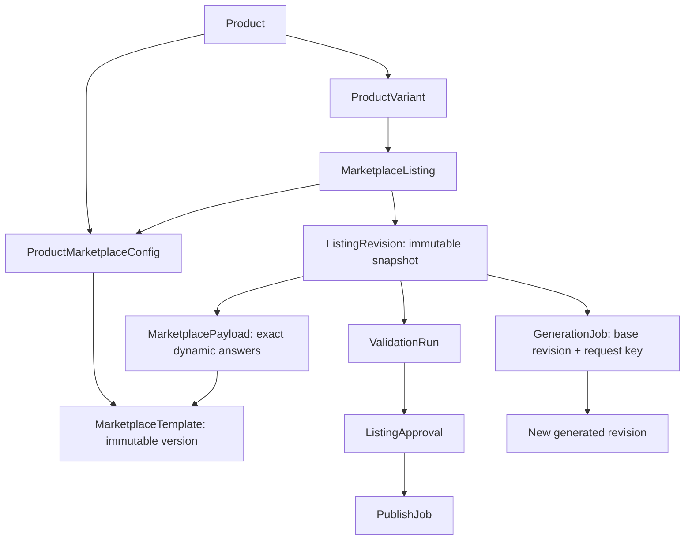

# Category-driven catalog: schema review and implementation

Reviewed against the four actual Seller Central XLSM workbooks on 2026-09-19. The current Node/Prisma API is the application database owner. The Python backend is largely a scaffold; its template parser and row adapter are useful, but there is no running generation/publishing pipeline yet.

## Workbook evidence

| Template | Definitions | Required | Conditional | Recommended | Optional | Export columns |
| --- | ---: | ---: | ---: | ---: | ---: | ---: |
| KURTA | 186 | 9 | 52 | 18 | 107 | 255 |
| PANTS | 197 | 9 | 59 | 10 | 119 | 252 |
| SHIRT | 190 | 9 | 57 | 13 | 111 | 253 |
| SHORTS | 217 | 10 | 81 | 14 | 112 | 277 |

The requirement counts above are rows in **Data Definitions**, not repeated export cells. PANTS has 197 definitions and 55 additional repeat slots, producing 252 columns. The old UI's 239 count was the remaining export cells after 13 common cells were excluded; it did not describe 239 independent form fields. The corrected editor groups by exact normalized pattern, counts a repeated definition once, and adds/removes values inside that group without renumbering saved keys. Identically labeled but distinct definitions (image locations, units, compliance document types) stay distinct.

There are 376 distinct exact columns across the files. Thirteen required exact columns are common: seller SKU, product type, title, brand, product ID type, description, five bullet cells, fabric type and country of origin. That is nine semantic field patterns, because bullet cells repeat.

These are four apparel categories, not evidence that fabric or five bullets are required in every Amazon category. `Product Id Type` also includes ASIN and GTIN Exempt; it is not equivalent to a universal product barcode type. Both remain governed by the channel template. SHORTS has one additional required dangerous-goods definition with five available slots. Local completeness requires a value for each required definition, not an answer in every repeated slot. The XLSM does not supply executable minimum-count or conditional rules; live marketplace validation may impose additional constraints.

The full field-by-field classification, exact keys, source hashes and requirement differences are in [`../test/amazon-templates/field-review.json`](../test/amazon-templates/field-review.json). Recreate it with `python3 test/review-amazon-templates.py` from the project root. Workbooks are read without running macros or treating example rows as product facts. No water-bottle XLSM was supplied.

## Storage decisions

| Concept | Authoritative storage | Why |
| --- | --- | --- |
| Product name and actual brand | `Product.name`, new `Product.brandName` | Stable merchant identity. Brand voice settings must not rename existing products. |
| Seller SKU, color, size/option | `ProductVariant` typed columns | Variant identity and ordinary catalog filters. |
| Prices, currency and stock | Existing Decimal/Int columns on `ProductVariant` | Exact persistence and database constraints. Marketplace-specific offer schedules remain channel attributes until an offer model/adapter is implemented. |
| Country of origin, HSN, weight | Existing typed `ProductVariant` columns, now exposed per SKU | The prior UI flattened these into the first variant. Missing weight is NULL, distinct from zero. |
| Title, description, bullets and keywords | Existing `ListingRevision` columns | Reviewed text is revision history, not mutable product identity. |
| Selected category and template | New `ProductMarketplaceConfig` | One immutable assignment per product/platform/region shared by all its variants. Amazon taxonomy does not become a universal product-category enum. |
| Fields, requirements, choices, browse nodes | Versioned `MarketplaceTemplate` JSONB | One shared category definition; no DDL for each new XLSM. |
| Source examples and dropdown validation behavior | `MarketplaceTemplate.sourceMetadata` JSONB | Includes source hash, definition row/example and suggestion-list keys. Can be enriched once from the same source file; immutable thereafter. Existing schema hashes and category assignments stay pinned. |
| Fabric, fit, material, size-system refiners, safety declarations, channel identifiers and other exact cells | `MarketplacePayload.rawAttributes` JSONB | Their applicability and allowed values depend on the selected template and channel. |
| Approval and delivery | `ListingApproval`, `PublishJob` | Approval targets a revision. Export, submitted and confirmed live are different outcomes. |

SQL NOT NULL and marketplace-required mean different things. A draft may be incomplete. Stable identifiers and ownership are database invariants; required template answers block review approval. Shared facts are merged with dynamic answers using `lib/marketplace-template.ts`; mapped core values cannot be overridden by JSON. A scalar fills only the first exact repeated cell. Later repetitions stay separately editable.

The category document is deliberately a flat JSON object of exact XLSM keys to string cell values. It preserves leading-zero identifiers, repetition indexes, units and dropdown spelling. It is not an untyped miscellaneous product blob and is not an SP-API payload. Numeric logistics already use numeric columns. A future API adapter must explicitly convert and validate these cells against the target API schema instead of guessing JSON types from prose.

The old `canonicalData.brand` may remain in historical/legacy data; `brandName` is authoritative for current reads and saves. Current saves remove the redundant brand value without rewriting historical snapshots. Other unrelated canonical metadata is preserved.

## Relationships and invariants

- Category, browse node and exact template version lock after assignment. The database rejects changing/unlinking that assignment or borrowing another product's config. A saved SKU cannot be reparented to escape the lock. The API also rejects changes with an actionable conflict response.
- Composite foreign keys retain workspace isolation. SKU uniqueness remains case-insensitive within a workspace. Product facts, variant facts and channel payloads have different owners.
- Templates can be activated/deactivated, but their content cannot be overwritten. Importing an updated XLSM creates a new version for new products. Existing products stay pinned. A version-upgrade workflow must be explicit and create newly reviewed revisions; ordinary product edits cannot switch templates.
- Dynamic writes reject unknown keys, non-string cells, invalid closed-enum values, mismatched template hashes/categories and duplicated mapped core fields. The importer reads the Template worksheet's validation flags: a stopping list is a closed enum; a non-stopping list offers suggestions. Amazon price dropdowns include Delete Offer while allowing numeric prices, so treating every dropdown list as an enum was incorrect. The UI, API, SQL guard and Python adapter now share this distinction. Application request limits and database payload limits bound input size. Conditional requirements remain visible guidance until executable rules are available.
- Listing revisions and payloads cannot be updated in place. Author deletion may clear the author FK without erasing content history. Saving a new edit revokes active approvals; old approvals remain auditable.
- `GenerationJob` now has workspace-scoped idempotency, base revision and template references. Inputs cannot be mutated after enqueue. A generated revision is rejected if a newer manual revision exists, and a job can have only one output revision. Listing row locks serialize manual/generated revision insertion.
- The current app requires local review validation to pass before approval. This is not marketplace acceptance. `PublishJob` already references an approval for the same revision and workspace; a future publisher must recheck its revocation and current seller permissions before dispatch.
- Explicit rules now cover scalar Rise Height, a single India HSN code, and external-information/compliance pairs matched by exact repeat slot. Missing partners remain savable as drafts but block approval and export; invalid numeric/code formats also fail saves. A regulatory ID requires its applicable compliance type and vice versa; both may remain blank when inapplicable. No compliance fact is inferred from an example. XLSM encodes Rise Height as numeric and identifiers as text. Remaining conditional/account rules still require marketplace validation.

## User flow implemented

1. Add product opens category selection first. For Amazon, select product type and browse category, then continue. Selection is locked in the remaining form.
2. Shared product identity, per-SKU facts and category answers are edited in separate sections. Required/entered category definitions show first; search and Show all expose the rest of that selected template only. Sample listings show all definitions by default. The headline counts Data Definitions entries; visible/category/common counts are separate. Each definition has its Example-column text and source row. Repeated values use an Add another control; their exact keys remain stable. Previous-category fields are hidden immediately when the selected template changes.
3. Save creates the product, immutable category config, variant listings, revision snapshots and exact dynamic answers in one transaction. Partial drafts are allowed. This implementation saves manual drafts; it does not pretend that a background AI job has run.
4. A ready catalog row opens field review. The saved category/version remains locked. Origin/HSN/weight round-trip separately for every variant. Approval checks all variants, not just the first. Each category error has a Fix field action that selects the exact SKU and repeat slot, opens its editor section, and shows the field with its related pair. Search accepts HSN through definition guidance; generic variant HSN links to the distinct Amazon export field. SKU selection persists across tabs. Refresh saved data loads server changes into a pristine editor and asks before discarding unsaved edits.
5. Approval is recorded against the reviewed revisions. Editing requires approval again. Download fills the pinned Amazon workbook's Template tab from row 7, one row per SKU. XLSM keeps all supporting sheets, styles and dropdowns; CSV retains rows 1–6 and the exact column order. Bulk export groups by pinned template version and returns separate files in a ZIP when necessary. Direct marketplace upload remains unavailable until authorization and the adapter exist.

The authenticated `POST /api/products/export` reads tenant-owned current revisions, unrevoked approvals and immutable merchant snapshots in a repeatable-read transaction. It accepts only product IDs, expected update timestamps and a format, never client-supplied facts or source paths. It checks the archived source SHA-256 and row-5 keys before export. An old approved snapshot can finish downloading if a concurrent edit occurs after the snapshot read; it cannot contain the unapproved new values. Downloads do not mark a listing published or create a submission job.

Core fields use the same mapping as field review; every saved dynamic answer maps to its exact column, including repeated slots. The browse-node ID is converted to the workbook's path-and-ID choice. Unanswered optional fields stay blank. Category-specific prices, quantities, sizes, images, weights and units use the reviewed Amazon attributes; generic variant metadata is not guessed into ambiguous item/package or apparel fields. Missing source files, populated source data areas, schema mismatches and obsolete approvals fail explicitly. XLSM stores literal text using the source column's text style, preserving SKU zeros and never turning seller content into formulas. Formula-leading CSV content asks for XLSM rather than altering the value.

The admin importer archives originals in `frontend/private/amazon-templates/<sourceSha256>.xlsm` (or `AMAZON_TEMPLATE_DIR`), including during `--extract-only`. Provision these private files in the server/build environment; raw sources remain gitignored. Keep every referenced version. The runtime only needs Node and the ZIP/XML libraries. Synchronous export is bounded to 100 products, 1,000 SKUs, 10 templates and 64 MB of generated files. Durable queued exports, object-storage retention and marketplace acceptance feedback remain future work.

Bulk CSV intake also requires one selected Amazon category per batch. It does not assume India as the product's origin. Synchronous imports are limited to 50 products, with at most 100 variants per product and the existing 4 MB request limit. Larger imports belong in background `ImportBatch` processing.

## Local workbook example previews

All 790 Example-column entries across the four workbooks are imported as source guidance. They are generic examples: KURTA includes a SHIRT product-type example, a Diet Bars browse example and a boots description. They are not seller facts or guaranteed valid values. The four known local dummy products are explicitly labeled workbook examples; their category, browse assignment and unique DEMO SKU remain fixed. Matching examples populate inputs, repeatable choice lists are split into exact slots, and incompatible enum examples remain visible as guidance. Current counts of those incompatible examples are KURTA 12, PANTS 10, SHIRT 11 and SHORTS 7.

`test/build-template-seed.py` and `test/workbook-examples.py` reproduce the data. `test/apply-workbook-examples.ts --apply`, run from frontend with the local server, updates only known dummy IDs via the authenticated API and appends revisions. It backs up current values and does not reapply over later edits once the source marker exists. Real/new products are never filled from examples automatically. The regular seed preserves existing data.

## Scalability and maintenance

Implemented: shared immutable templates, small typed identity records, composite tenant FKs, lookup indexes on config ownership/template references, append-only revision history, bounded synchronous imports, reusable field mapping, per-SKU validation, and generation idempotency/stale-result guards. Save/approve responses now read only the affected product(s); the frontend merges those into its existing cache instead of reloading the entire catalog after every edit.

Avoid a new table or migration for every product type, adding every common apparel field as a universal column, or a generic per-cell EAV table. A field should become a typed column because its meaning and query/workflow needs are stable, not merely because it appears in several files. Add targeted expression/GIN indexes only when measured JSON predicates need them; the present access path reads answers by indexed revision ID.

Remaining work before claiming high-volume production readiness:

- Replace the initial eager `readWorkspace` catalog load and client-side filtering with indexed server pagination and a lightweight summary DTO; fetch full variant/payload details on demand. The current initial load remains unsuitable for very large catalogs.
- Connect a durable worker. Enqueue atomically using an outbox or poll durable QUEUED jobs, claim with a lease, retry with backoff, and reconcile abandoned leases. UI polling/SSE should read real job state. The schema supports this; no LLM worker is connected in this change.
- Move image bytes out of the prototype base64 field into `MediaAsset` object-storage references, with revision-pinned media manifests and lifecycle cleanup.
- Add executable conditional validation, seller authorization, direct API submission and marketplace-processing feedback. The original-template exporter exists; account permissions, GTIN exemption eligibility and image/offer correctness cannot be certified by these XLSM files.
- Production operations still need deployment-specific role grants, restore drills, monitoring, load tests, retention policy and database capacity measurements. Existing workspace authorization is not a claim of a completed security certification.

The Python worker should use an internal authenticated Node service for catalog writes so Prisma transactions, revision checks and template rules stay in one place. It should receive immutable input/template references and return proposed content; it should not independently update a second SQLAlchemy schema.

## Migration and verification

`20260919000000_category_contract` backfills brands and current category bindings without rewriting historical payloads. It refuses conflicting category/template assignments within a product family instead of choosing one silently. Legacy products without a template remain unbound and must select a valid category before Amazon approval. `20260919010000_variant_ownership` prevents reparenting existing SKUs.

Apply migrations before deploying the generated Prisma client and updated server code. Existing local data is preserved; hosted databases need their own planned migration. Keep a private backup. A downgrade needs the old application plus a deliberate schema rollback/restore, not deletion of revision history.

Validation includes isolated PostgreSQL migration/constraint tests, all four XLSM required-field and exact-key tests, TypeScript/build checks, authenticated API save/reload/approval tests and browser category/form review. See the latest entry in `../Memory.md` for the completed run and its limits.
