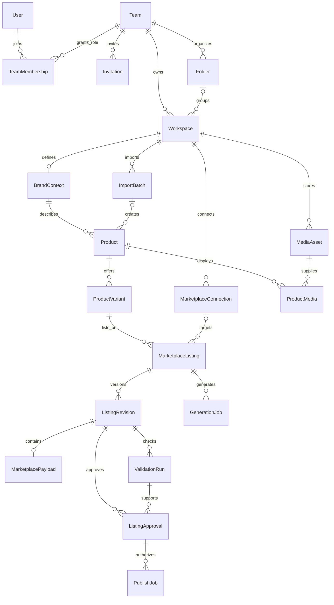

# Catalog database — Prisma + PostgreSQL

> **2026-09-13 local database update:** Sign-in and workspace persistence now use local PostgreSQL + Prisma. See [local database guide](../../test/README.md) for startup, seed data and account details. Earlier prototype-only sections below are historical where they conflict with this update.

`schema.prisma` is the canonical database design. The earlier `../../test/data.prisma` remains untouched as a historical reference. The frontend reads and writes this schema through authenticated Next.js server routes; the Python backend is not required for the current database-backed slice.

## Design decisions

### Category contracts and static facts (2026-09-19)

See [CATALOG-DESIGN.md](../CATALOG-DESIGN.md) for the four-XLSM field review, storage map and rollout limits. `Product.brandName` is now typed. `ProductMarketplaceConfig` locks category, browse node and template version per product/channel, shared by all variants. SQL guards enforce category ownership, exact-key JSONB contracts, immutable templates/revisions/payloads and generation input versions. Origin, HSN and weight are edited per SKU. The two new migrations preserve current records and backfill four local category configurations. Apply all migrations before deploying the regenerated Prisma client. Initial catalog pagination, the AI worker, object storage and official marketplace delivery remain separate production work.

### Category template versions (2026-09-18)

`MarketplaceTemplate` is an immutable, global reference catalog imported from reviewed Amazon XLSM workbooks. Scope is platform + marketplace ID + product type + language; a PostgreSQL partial unique index permits one active version per scope. A semantic SHA-256 makes re-import idempotent. Template fields and choices are ordered JSONB, so a new category adds data rather than changing product tables. Repeated Amazon columns retain exact headers while sharing a normalized pattern for common concepts. `MarketplaceListing` stores selected product type and browse node; `MarketplacePayload.templateId` can pin the exact definition for a reviewed revision. Old versions remain because payloads reference them restrictively. See [Amazon template ingestion](../../test/amazon-templates/README.md) for the extractor, import command and current four-category inventory.

The template source is category metadata, not actual merchant facts or a guarantee of Amazon acceptance. The current frontend still needs a template-driven editor, category-specific answers, live validation and official export/submission before those records can publish.

- **One brand context per workspace.** An agency can create a workspace for each client brand. Individual and freelance users also work inside teams/workspaces; a team can contain just one person.
- **Users can join multiple teams.** Their role belongs to `TeamMembership`, not to the global user record.
- **Folders organize workspaces within a team.** A composite foreign key prevents assigning a workspace to another team's folder.
- **Products own shared facts; variants own sellable options.** SKU, prices, stock, logistics, color, size, and category-specific refiners belong to the variant.
- **A variant can appear on Amazon and Flipkart.** Each platform/region gets its own listing, external ID (ASIN/FSN), content revisions, payloads, validation, and publication state. This first schema supports one seller account per variant/platform/region listing, not simultaneous duplicate listings on multiple accounts of the same platform/region.
- **Drafting does not require a marketplace connection.** A connection is optional until direct publishing is requested. CSV export works without OAuth.
- **An approval covers one exact revision.** The publish job, approval, audit, revision, platform, and workspace must match through foreign keys. A publishing job captures its own target connection so a later connection change on the listing does not redirect that job.
- **Prices use `Decimal(14,2)` with currency**, not JavaScript floating-point or unspecified integer units. Current frontend INR input maps to exact decimal rupees.
- **Soft deletion preserves SKU identity and history.** Workspaces/teams can be archived; products/variants have `deletedAt`. Historical listing/review/publish records use restrictive delete behavior.

## Relationship overview



## Models and their responsibilities

| Model                 | Purpose                                                                |
| --------------------- | ---------------------------------------------------------------------- |
| User                  | Person, normalized login ID/email, optional password hash, account type |
| AuthIdentity          | Google provider subject linked to a user                               |
| Team                  | Agency/company/personal ownership boundary                             |
| TeamMembership        | User's role in one team                                                |
| Invitation            | Hashed invitation token, recipient, role, expiry, acceptance           |
| Folder                | Named grouping within a team                                           |
| Workspace             | Client/brand workspace owned by a team                                 |
| BrandContext          | Name, tone, glossary, banned terms, pain points, optional embedding    |
| MarketplaceConnection | Workspace seller account and encrypted-token fields                    |
| Product               | Shared name, category, original notes, canonical facts, attributes     |
| ProductVariant        | Unique workspace SKU, options, exact prices, inventory, logistics      |
| MarketplaceListing    | Variant + channel + region + ASIN/FSN + lifecycle                      |
| ListingRevision       | Versioned title, bullets, description, keywords, A+ content, snapshots |
| MarketplacePayload    | Revision-specific category/template attributes; no circular FK         |
| GenerationJob         | Queue job, attempts, frozen input, status and errors                   |
| ValidationRun         | Ruleset version, score, errors, warnings for one revision              |
| ListingApproval       | Reviewer and validation run for an exact revision                      |
| PublishJob            | Approved export/submission, target, idempotency key, response, result  |
| MediaAsset            | Storage key, kind, MIME type, byte size, ownership                     |
| ProductMedia          | Ordered parent/variant gallery; main image selection                   |
| ImportBatch           | Source CSV, queue status, row counts, row errors                       |

## Frontend field mapping

| Current frontend field                                  | Database destination                                                           |
| ------------------------------------------------------- | ------------------------------------------------------------------------------ |
| `profile.username`, `name`, `email`, `type`             | User username/displayName/email/accountType                                    |
| `profile.team`, `workspace`                             | Team and Workspace names                                                       |
| `brand.name`, `tone`, `painPoints`                      | BrandContext fields                                                            |
| `brand.glossary` comma-delimited input                  | BrandContext.glossary object, e.g. phrase-to-definition entries                |
| `brand.bannedTerms` comma-delimited input               | BrandContext.bannedTerms string array                                          |
| Product `name`, `category`, `rawText`                   | Product name/categoryPath/rawInputText                                         |
| Variant `sku`, `color`, `size`, `price`, `mrp`, `stock` | ProductVariant sellerSku/color/size/sellingPrice/mrp/stock                     |
| Current product-level HSN/origin/weight                 | Move to each ProductVariant; the UI currently edits only one shared value      |
| `marketplace`                                           | MarketplaceListing.platform; target seller account is separate                 |
| `title`, `description`, `bullets`, `keywords`           | ListingRevision content; split keywords into an array                          |
| Apparel fit/pattern/fabric/sleeve/neckline              | ProductVariant.attributes, validated by the category contract                  |
| Flipkart procurement/handling/tax extras                | MarketplacePayload.rawAttributes for the exact revision                        |
| Uploaded data URL                                       | Upload bytes to object storage; create MediaAsset and ProductMedia             |
| `score`                                                 | Most recent applicable ValidationRun.score                                     |
| `approved`                                              | Active ListingApproval for the current revision, not a mutable boolean         |
| Catalog `status`                                        | API-derived presentation of listing, generation, audit, and publication states |
| Onboarding source and progress                          | WorkspaceOnboarding status, current step, acquisition source, and target marketplaces |
| Product source files and marketplace facts              | ProductIntake queue status, file manifest, product ID type, materials, dimensions, and feature facts |

Keep JSON structured; it is not a replacement for foreign keys. `merchantSnapshot` should capture the variant facts, prices, inventory, and media keys used for review. `brandContextSnapshot` records the exact brand rules used. `targetSnapshot` records the connection ID, seller ID, platform, marketplace region, and template/version used for a publish attempt. Never include OAuth tokens in snapshots.

## Setup and commands

Run commands from `frontend/`:

```bash
npm install
npm run db:format
npm run db:validate
npm run db:generate
```

Formatting, validation, and generation do not need a database. The client is generated into `generated/prisma/`, which is ignored by Git. Import it only from server modules once the API layer is implemented. A runtime PostgreSQL adapter and server-side Prisma client initialization are intentionally not added yet.

The CLI uses `prisma.config.ts`, which loads `.env.local` and then `.env` without overriding existing process variables. It follows [Prisma 7's configuration conventions](https://www.prisma.io/docs/guides/upgrade-prisma-orm/v7). Prisma CLI/client are pinned together at 7.10.0. Use Node 22.12+ for the full toolchain; the Dockerfile now uses Node 22. The Prisma package supports Node 20.19+, but an optional CLI development-service dependency advertises Node 22+.

To provision a real database later:

1. Prepare a PostgreSQL database with the `vector` extension available on the server. PostgreSQL 16+ with pgvector is the intended deployment target.
2. Put its actual connection string in `frontend/.env.local` as `DATABASE_URL`. The committed `.env.example` contains example credentials only.
3. Review `migrations/20260913000000_initial_catalog/migration.sql`.
4. Apply it with `npm run db:migrate:deploy`. This is a real database write and was **not run against an application database** in this task.
5. For future schema changes in a disposable development database, use `npm run db:migrate:dev -- --name meaningful_change` and review the resulting SQL.

Do not use `prisma db push` as a substitute for this migration history: the SQL includes pgvector activation, checks, and partial/expression indexes that Prisma's schema language cannot fully express. Never rewrite a migration once applied; create a new one.

`uuid()` and `@updatedAt` are Prisma-side defaults. Raw SQL writers, including any future Python worker, must supply UUIDs and updated timestamps themselves (or the team must deliberately add database defaults/triggers in a later migration).

## Database-enforced constraints

- Workspace-scoped foreign keys keep brands, products, variants, media, imports, marketplace accounts, revisions, approvals, and publish jobs from crossing tenant boundaries.
- One variant cannot have two listings for the same platform/region.
- Workspace SKU uniqueness is case-insensitive, with blank/untrimmed SKUs rejected. Soft deletion does not release the SKU.
- Prices/stock/measurements cannot be negative; selling price cannot exceed MRP; decimal NaN/infinite values are rejected.
- Revision numbers are positive and unique per listing.
- Validation scores are 0–100. A passed validation cannot contain errors.
- Approval cannot reference an audit of another revision. A publish job cannot reference an approval of another revision.
- Direct API jobs require a same-platform, same-workspace connection.
- CSV jobs cannot become `SUBMITTED`/`PUBLISHED`; API jobs cannot become `EXPORT_READY`.
- Completed export/submission/publication states require the corresponding result IDs/files/timestamps.
- At most one active approval exists for a revision.
- Parent and variant galleries have distinct ordered positions and at most one main image each.
- Invitation emails are normalized; only one pending invitation per team/email is allowed.
- Generation attempts and bulk-import counters are bounded.

## Rules the eventual service must enforce transactionally

The schema is not an authorization engine. Before connecting the UI or queue workers:

1. Authenticate the user and check team membership/role for every operation. Derive workspace ownership from trusted relations, not a client-provided workspace ID. Keep at least one owner in each team.
2. Normalize email addresses and SKU whitespace before insertion. Validate category-specific JSON fields, media types, URL policy, and real marketplace templates.
3. Create each revision and its payload atomically. Treat revisions/payloads as append-only; the current migration does not install immutability triggers.
4. On edit, append a revision with a new number using a transaction/concurrency retry. Never mutate an approved revision or repurpose its payload. The new revision has no approval.
5. Before approval, require a completed `PASSED` audit of the exact current revision, appropriate reviewer permissions, and verified merchant facts. The FK enforces revision identity, not the audit's passed state.
6. Before scheduling and executing publication, recheck that approval is active and applies to the selected revision, the connection is usable, and the publisher is authorized. Specify whether publishing an older approved revision is permitted; default to current revision only.
7. Save an immutable target snapshot and reuse an idempotency key for retries. Mark `PUBLISHED` only after marketplace confirmation, not merely after request acceptance.
8. Atomically consume invitation tokens, checking expiry, status, email, and permitted role. Expire stale pending invitations before issuing replacements. Never persist raw invitation tokens.
9. Encrypt tokens outside Prisma using managed keys, and refresh them in a server-only service. A column named `encrypted_*` does not implement encryption.
10. Convert Decimal/BigInt values deliberately at API boundaries. Do not pass Prisma models directly to JSON serializers or client components.

## AI and pgvector boundary

The optional `vector(1536)` field retains the dimension from the user's draft. Set `embeddingModel` and `embeddedAt` when embeddings are written; do not assume a provider/model from the dimension alone. Prisma treats vector as an unsupported type, so embedding writes and similarity queries require parameterized raw SQL or a dedicated integration. No model keys, retrieval pipeline, or vector indexes are configured here.

Python FastAPI and LangGraph/ARQ files remain unchanged. The recommended integration boundary is a Node server owning Prisma transactions and exposing authenticated operations to the frontend and workers. If Python writes directly to PostgreSQL instead, agree on the same transaction, revision, approval, and timestamp contracts before doing so.

## Verification

```bash
npm run test:db
npm run test:prototype
```

`test:db` applies the exact initial migration to a fresh, in-memory [PGlite PostgreSQL engine with pgvector](https://pglite.dev/extensions/). It does not load `DATABASE_URL`, run against a developer/production database, or persist test rows. The 17 checks cover table/extension creation, tenant boundaries, SKU uniqueness, prices/stock, per-channel listings, matching revision/audit/approval/publish links, export states, and vector dimensions.

Prisma validation and client generation also pass. These checks do not verify deployment permissions, production PostgreSQL settings, marketplace rules, service authorization, or concurrent job execution.

For reproducibility: Prisma 7.10's native schema engine requires a syntactically valid datasource even for an empty-to-schema diff. The baseline SQL was generated with a **command-local placeholder URL on localhost port 1**, not a real connection. No placeholder URL is used as a default in application configuration. The generated SQL was wrapped in a transaction, prefixed with pgvector activation, and extended with the documented SQL-only constraints before testing.
